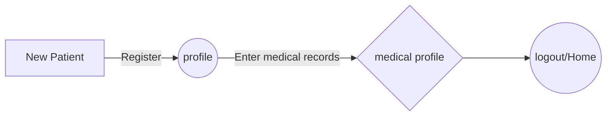

# Clinical Data Management tool

This is a tool that acquires and systematically stores user data for reference and analysis. With the data acquired, cutting-edge machine learning techniques can be applied to proffer medical advisory and diagnostics for patients with a wide range of symptoms

#### Setup virtual environment in project folder
`python -m venv venv
`
#### Activate virtual environment
`venv\Scripts\activate`

#### To run the project
`python manage.py runserver`

### Applicable links
- Home page
`http://127.0.0.1:8000/`
- All Patients: to view all patients
`http://127.0.0.1:8000/allPatients`
- View Patient: to view a specific patient
`http://127.0.0.1:8000/patientProfile/<id>`
- Add Patient: to add a new patient
`http://127.0.0.1:8000/add`
- Update Patient: to update patient details
`http://127.0.0.1:8000/updatePatient/<id>`
- Add medical record: to input medical records
`http://127.0.0.1:8000/addClinicData`
- View all medical records: to view all medical records
`http://127.0.0.1:8000/allRecords`
- Admin panel: to view all data with admin priviledges
`http://127.0.0.1:8000/admin`

#### Miniature flowchart

###  Potential additions/New features

A machine learning diagnostic feature that works based on multiclass sentiment analysis. It'll help classify stipulated the type of illness suffered by a patient based on the provided symptoms and description.

structure

|   Patient         |Combined symptoms                          |Predicted illness                         |
|----------------|-------------------------------|-----------------------------|
|Patient_x           | Headache stooling vomiting dehydration| 	`Dysentery`
|Patent_y          |diziness, loss of apetite, vomiting, general body weakness            |`Pregnancy`            |
|Patient_z          |breathing difficulty chest pain cough chest tightness|`Asthma`|
